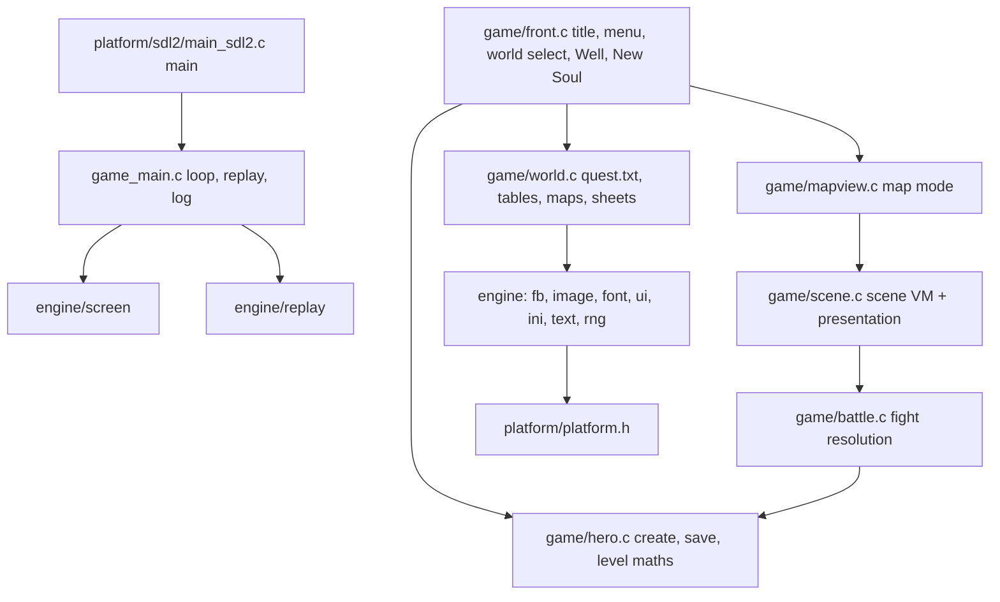

# Port architecture

## Module graph

Everything outside `src/platform/` is host-independent C99. `src/platform/platform.h` is the only boundary:
video present, input events, time, case-insensitive file open and directory listing, WAV sound and MIDI music.

## Game loop
The loop follows the original's `CWinApp::Run` (0x40A8D9). Each pass handles input, then due timers, then idle/paint, all
on a virtual millisecond clock (`src/engine/clock.c`). The idle pass is gated at 20 ms (FUN_0040A7C7) and the world
step at 25 ms (FUN_0042895C, which also burns one `rand()` per idle pass). Rules read `clock_ms()`, the port's
GetTickCount, using the original's literal millisecond constants; nothing counts frames. Randomness comes from the
MSVC6 CRT LCG (`crt_rand`), called at the same points and in the same order as the original. Boot seeding is
srand(time), rand(), srand(time), as in FUN_004269AF. With `--script`/`--replay` the clock moves only on schedule
(including onto each 20 ms idle boundary), so runs are deterministic. Interactive runs attach the clock to real time.
See docs/re/timing.md and docs/re/rng_calls.md.

## Android
- `tools/fetch_android.sh` installs into /mnt/build: SDK API 34 and build-tools 34 (android-sdk/), NDK 26.3.11579264, CMake 3.22.1 and SDL2 2.32.10 (android-deps/). The wrapper pins Gradle 8.9 and AGP 8.7.3 on JDK 21, with `GRADLE_USER_HOME=/mnt/build/gradle`.
- `cd android && ./gradlew assembleDebug` bootstraps the missing SDK/SDL, extracts the installer and builds `app/build/outputs/apk/debug/app-debug.apk` (arm64-v8a, minSdk 23, targetSdk 34). The native library is built from the same source list as desktop (`cmake/wos_sources.cmake`).
- The game data is packaged as APK assets with a sorted SHA-256/size manifest. `src/platform/sdl2/assets_android.c` copies them into SDL internal storage `data/` on first launch or when the manifest changes, writing `.part` files, renaming them, and writing the commit marker last. Saves go to internal storage `saves/`. On Android, `main_sdl2.c` supplies `--data`/`--save` itself.
- The logical 640x480 presentation is letterboxed on every platform, and mouse/touch coordinates are remapped. Android runs landscape fullscreen; Back = Escape; a focused text field opens the soft keyboard (`plat_text_input`).
- Music on Linux, Windows and Android uses vendored TinySoundFont (`src/third_party/tsf.h` MIT, `tml.h` zlib, pinned at 853a0a1) with the TimGM6mb General MIDI soundfont (GPLv2, pinned d6ad4ed, sha256 c5378b62…). The soundfont is not committed: `tools/fetch_soundfont.sh` puts it and its license in `~/.cache/wos-soundfont`. Desktop builds copy it next to the executable. Lookup order: `WOS_SOUNDFONT`, then the executable dir, then the home cache. The APK packages it as an asset and streams it through SDL_RWops. MIDI is synthesized in the SDL audio callback together with the 8 WAV voices (stereo 44.1 kHz S16, soft limiter). SDL2_mixer is no longer used. If the soundfont is missing, a warning is logged once and only music is disabled.

## Mapping from the original to the port
| Original (Souls.exe) | Port |
|----------------------|------|
| CSoulsView state machine FUN_0041b891 (title/menu/world/Well) | front.c screens |
| New Soul dialog 138 (FUN_0045fda9/FUN_00460a7e) | front.c New Soul panel |
| quest.txt loader FUN_00479594..FUN_00479a02 | world.c world_load |
| map loader FUN_0041e421, .obl FUN_00463989, .mon FUN_00464461 | world.c map_load |
| map walking FUN_004620f3/FUN_0046230e, links FUN_00463853 | mapview.c |
| random encounter FUN_00490e7c state 1, FUN_0049099b | mapview.c + battle.c |
| scene interpreter FUN_0047d577 opcode switch | scene.c |
| fight state machine FUN_00490e7c, damage FUN_004a7794, payout FUN_0042bb5c | battle.c |
| filmstrip loader FUN_0048df3c / FUN_0048dad9 | world.c sheets |
| training screens: hand click 0x419107, element click 0x425c30, erosion 0x4258b8 | hero.c hero_train, panels.c PANEL_TRAIN |
| inventory/equip (0x40C694 attack/defense totals), item use | hero.c, panels.c PANEL_ITEMS/PANEL_EQUIP |
| OFFER/OFFER2 shops (filter all.c:93027) | panels.c PANEL_SHOP, opened by scene.c |
| spell casting, monster AI (FUN_004809a3, FUN_00490645), weapon spell binding | battle.c |
| detour pathfinder FUN_00461b11/FUN_00461b93/FUN_00461dcc | mapview.c |
| music.ini playlists, fight/victory music | world.c world_music, audio.c game_music |
| map hero blit FUN_00416426 (sub-cell InflateRect -1) | world.c sheet_draw_map_dir |

## Deliberate deviations
Only presentation and host differences remain. Every rule/outcome row from earlier versions (60 Hz timing, the `.wsh`
saves, the `.cookies` sidecar, always-successful flee, pathfinder clearance, per-step encounters, the skipped PK and
placement prompts, the TIMER clock, WEATHER/FX/PARTY) was replaced by the original's behaviour.

| Deviation | Reason |
|-----------|--------|
| MFC dialogs and child windows (New Soul, Pick-a-Soul, shop, items, missions, mini-games, trophy bag, pet pen, chat splitter, MessageBoxes) are drawn as in-framebuffer panels. They accept the scripted `dialog` op with the original's resource and control ids; flows, validation and outcomes are the original's | there is no portable MFC |
| The "Place Yourself" map picker (FUN_00434F95) is a simple map/link chooser instead of the original's live map widget. When it appears, what it writes (map, link) and the save it triggers match the original | presentation |
| Text uses an embedded 8x8 bitmap font instead of Tempus Sans ITC. Hotspot anchors use the original's per-mille arithmetic (FUN_00405153/0x405194); the hit-rect extents come from our font metrics | no TrueType in the core; the anchor, not the extent, decides which entry a click selects |
| The layout is computed for a 640x480 client area and scaled to the window by the platform | the differential oracle runs the original at a 640x480 client |
| Spell and attack effects are element-coloured flashes, not the effectsNN/attackNN strips. The effect placement rands, damage, timing and fizzle follow the decomp | presentation only |
| Networking (SRNet.dll): online worlds, PK duels, chat channels other than Solo, server vars and the ladder | offline target. Offline code paths behave as the original does when no network is present |
| Arrow-key walking and keyboard shortcuts for menus and fights | extra input that triggers the same actions as the original's mouse clicks |
| world.ver signing leaves the 4 bytes at +0x4A4 zero. The original stores a leaked heap address there | not reproducible |
| A missing music file (Evergreen `lost.mid`, named in music.ini but never shipped) logs `music_error` | the retail data is incomplete |
| The Terms of Service acceptance (FUN_00402A73) is remembered by a size+hash of tos.rtf in `<save>/legal.ini` [LEGAL] TOS_DATE, where the original stores a ctime() string parsed out of the RTF (FUN_0044BA39) in WIN.INI | the re-prompt rule (ask again when the document changes) and the accept/decline outcomes are the original's; the stored key differs |

### Known open parity items (not deviations; unfinished)
- Front-end state 2 → world list (measured by the oracle, docs/re/oracle.md §7.1). FUN_0041F699 (0x46B) enters state 2 and sends the synchronous 0x46F. Its handler 0x42AA10 opens SRNet's modal "Where would you like to play today? (tm)". Clicking Solo Game (1005) and then Play Game (1) closes it, and 0x46F returns 1. FUN_0041D374 then registers "..Scanning...", and the solo stepper FUN_00438E8E runs from FUN_0042895C (0x428B89) for about 2.3 s. FUN_0041B891(3) then shows the world list (FUN_0041D717/FUN_0041D3CC). The port models the modal in the framebuffer; its drawing is presentation only. Why SRNet needs Solo selected before Play Game acts is SRNet's own dialog rule, which is not established.
- Palette population (FUN_0043BE95) is implemented and caller-driven; nothing in the current differential scripts reaches it.
- The "monsters seen" tally writer (FUN_0043AB20 in FUN_00464DAF's gate arm) and the 144-entry spawn roster (FUN_0047C1E4) are not written by the port.
- Idle RNG cadence after boot. The original's FUN_0040A7C7 → FUN_0042895C draws one rand() per entry (0x428996, unconditional). The port enters it from the id-0x16 timer armed by SetTimer(hwnd, 0x16, 100, NULL) at 0x428803, so it draws every 100 ms. Under the Wine oracle the original draws once per ~160–200 ms: 1414→1418 between t=150 and t=800, then →1421 by t=1400. It is the same draw sequence: the port's state at t=800 (1421 calls, 1973901911) equals the oracle's state at t=1400. So the difference is WM_TIMER delivery cadence under the harness, not a missing or extra rand. The port keeps the binary's 100 ms period, because nothing in the binary names a slower one. Any comparison after boot has to be aligned by rng.calls rather than by wall time.

## RE corrections found during porting
See REVERSE.md "Corrections to docs/re/*.md".
