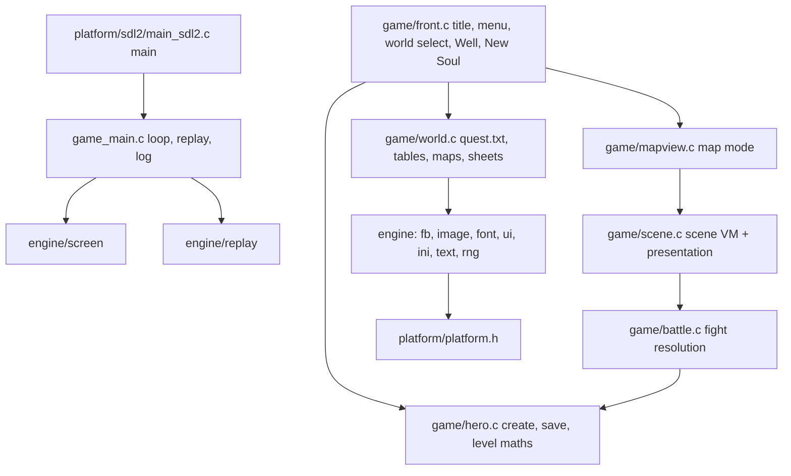

# Port architecture

## Module graph

Everything outside `src/platform/` is host-independent C99. `src/platform/platform.h` is the only boundary:
video present, input events, time, case-insensitive file open and directory listing, WAV sound and MIDI music.

## Game loop
The loop runs a fixed 60 Hz step (`game_main.c`). Each step polls platform events (or injects replay events), calls the
current `Screen.update`, calls `Screen.render` into a 640x480 0x00RRGGBB framebuffer, then calls `plat_present`. Game
logic counts steps and never reads the wall clock. As a result, `--replay` runs are deterministic and can run faster
than real time.

## Mapping from the original to the port
| Original (Souls.exe) | Port |
|----------------------|------|
| CSoulsView state machine FUN_0041b891 (title/menu/world/Well) | front.c screens |
| New Soul dialog 138 (FUN_0045fda9/FUN_00460a7e) | front.c New Soul panel |
| quest.txt loader FUN_00479594..FUN_00479a02 | world.c world_load |
| map loader FUN_0041e421, .obl FUN_00463989, .mon FUN_00464461 | world.c map_load |
| map walking FUN_004620f3/FUN_0046230e, links FUN_00463853 | mapview.c |
| random encounter FUN_00490e7c state 1, FUN_0049099b | mapview.c + battle.c |
| scene interpreter FUN_0047d577 opcode switch | scene.c |
| fight state machine FUN_00490e7c, damage FUN_004a7794, payout FUN_0042bb5c | battle.c |
| filmstrip loader FUN_0048df3c / FUN_0048dad9 | world.c sheets |

## Deliberate deviations
| Deviation | Reason |
|-----------|--------|
| MFC dialogs and child windows (New Soul, Pick-a-Soul, chat splitter) are drawn as in-framebuffer panels | there is no portable equivalent of MFC; the flow and validation rules are kept |
| Fixed 640x480 layout, scaled to the window by the platform | the original sized its layout from the client rect |
| Text uses an embedded 8x8 bitmap font instead of Tempus Sans ITC | no TrueType dependency in the core |
| Hero saves use a port format (`.wsh`) under `--save`, not the encrypted/serial-bound `.her` | `.her` is tied to the machine's soul ID |
| Networking (SRNet.dll), online worlds, PK, the chat and the world CRC check are not implemented | the target is offline solo play |
| Every GetTickCount timing is converted to 60 Hz steps | deterministic replays |
| OFFER/OFFER2 shops are shown as display-only catalogues | buying and selling is outside the offline acceptance path; flagged for later work |
| Quest cookies (`#<name>`) persist in a per-hero `.cookies` sidecar next to the save | the original keeps them server-side or in the `.her` blob |
| Click-to-walk marches in a straight line and stops at blocked terrain; the original's detour pathfinder (FUN_00461dcc) is not ported yet | the simplest correct subset; flagged |
| Encounter roll uses hunting rating 0 for a fresh hero: 200/10000 per moving 60 Hz step (original: per timer tick) | the tick was converted to steps |
| LOCK has no online peers to lock out | solo only |
| Arrow-key walking on the map, plus keyboard shortcuts for menus and fights | lets deterministic replays drive the game; mouse behaviour is unchanged |
| Battle: when group 0 does not force all members, the neutral group-member probability is fixed at 50%; the link-distance weighting is not applied | battle_begin does not receive the distance to the link; flagged |
| Battle: solo flee always succeeds | nothing else in solo play can reject it |
| Battle: hand-training PP gains are capped at 5,000,000, not per-class caps | world.h does not expose the class training caps yet; flagged |
| Battle: only physical combat; no spell casting, spell-proc equipment or scripted monster AI (monsters.txt arg20) | outside the first-fight acceptance path; flagged |
| No "Place Yourself On Gaiea" prompt after the first incarnation; a fresh hero starts above link 0 of map 0 | the prompt places the player on the online world globe (FUN_00434f95("earth")) |
| The PK opt-in confirmation in New Soul is skipped (always non-PK) | there is no PK in solo play |

## RE corrections found during porting
See REVERSE.md "Corrections to docs/re/*.md". Map encounters follow the decomp: the difficulty-0 `.mon` suppression applies ON the nearest link, and the proximity tiers are 0.5 and 0.25.
