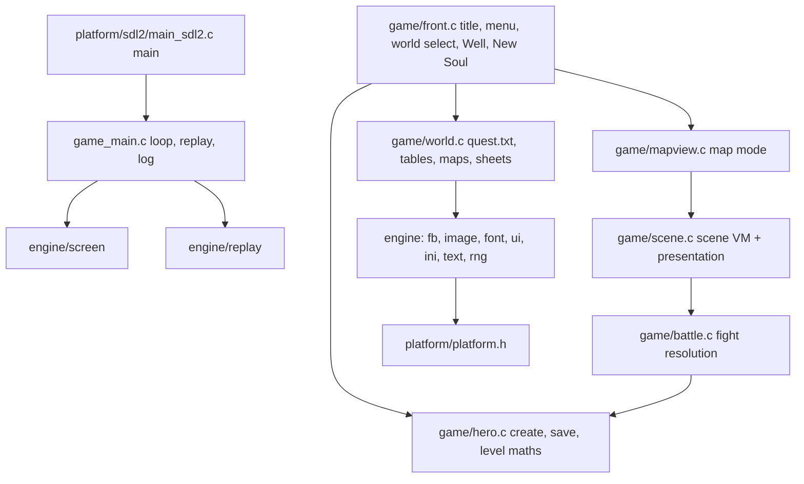

# Port architecture

## Module graph

Everything outside `src/platform/` is host-independent C99. `src/platform/platform.h` is the only boundary:
video present, input events, time, case-insensitive file open and directory listing, WAV sound and MIDI music.

## Game loop
The loop follows the original's `CWinApp::Run` (0x40A8D9). Each pass handles input, then due timers, then idle/paint, all
on a virtual millisecond clock (`src/engine/clock.c`). The idle pass is gated at 20 ms (FUN_0040A7C7) and the world
step at 25 ms (FUN_0042895C, which also burns one `rand()` per idle pass). Rules read `clock_ms()`, the port's
GetTickCount, using the original's literal millisecond constants; nothing counts frames. Randomness comes from the
MSVC6 CRT LCG (`crt_rand`), called at the same points and in the same order as the original. Boot seeding is
srand(time), rand(), srand(time), as in FUN_004269AF. With `--script`/`--replay` the clock moves only on schedule
(including onto each 20 ms idle boundary), so runs are deterministic. Interactive runs attach the clock to real time.
See docs/re/timing.md and docs/re/rng_calls.md.

## Android
- `tools/fetch_android.sh` installs into /mnt/build: SDK API 34 and build-tools 34 (android-sdk/), NDK 26.3.11579264, CMake 3.22.1 and SDL2 2.32.10 (android-deps/). The wrapper pins Gradle 8.9 and AGP 8.7.3 on JDK 21, with `GRADLE_USER_HOME=/mnt/build/gradle`.
- `cd android && ./gradlew assembleDebug` bootstraps the missing SDK/SDL, extracts the installer and builds `app/build/outputs/apk/debug/app-debug.apk` (arm64-v8a, minSdk 23, targetSdk 34). The native library is built from the same source list as desktop (`cmake/wos_sources.cmake`).
- The game data is packaged as APK assets with a sorted SHA-256/size manifest. `src/platform/sdl2/assets_android.c` copies them into SDL internal storage `data/` on first launch or when the manifest changes, writing `.part` files, renaming them, and writing the commit marker last. Saves go to internal storage `saves/`. On Android, `main_sdl2.c` supplies `--data`/`--save` itself.
- The logical 640x480 presentation is letterboxed on every platform, and mouse/touch coordinates are remapped. Android runs landscape fullscreen; Back = Escape; a focused text field opens the soft keyboard (`plat_text_input`).
- Music on Linux, Windows and Android uses vendored TinySoundFont (`src/third_party/tsf.h` MIT, `tml.h` zlib, pinned at 853a0a1) with the TimGM6mb General MIDI soundfont (GPLv2, pinned d6ad4ed, sha256 c5378b62…). The soundfont is not committed: `tools/fetch_soundfont.sh` puts it and its license in `~/.cache/wos-soundfont`. Desktop builds copy it next to the executable. Lookup order: `WOS_SOUNDFONT`, then the executable dir, then the home cache. The APK packages it as an asset and streams it through SDL_RWops. MIDI is synthesized in the SDL audio callback together with the 8 WAV voices (stereo 44.1 kHz S16, soft limiter). SDL2_mixer is no longer used. If the soundfont is missing, a warning is logged once and only music is disabled.

## Mapping from the original to the port
| Original (Souls.exe) | Port |
|----------------------|------|
| CSoulsView state machine FUN_0041b891 (title/menu/world/Well) | front.c screens |
| New Soul dialog 138 (FUN_0045fda9/FUN_00460a7e) | front.c New Soul panel |
| quest.txt loader FUN_00479594..FUN_00479a02 | world.c world_load |
| map loader FUN_0041e421, .obl FUN_00463989, .mon FUN_00464461 | world.c map_load |
| map walking FUN_004620f3/FUN_0046230e, links FUN_00463853 | mapview.c |
| random encounter FUN_00490e7c state 1, FUN_0049099b | mapview.c + battle.c |
| scene interpreter FUN_0047d577 opcode switch | scene.c |
| fight state machine FUN_00490e7c, damage FUN_004a7794, payout FUN_0042bb5c | battle.c |
| filmstrip loader FUN_0048df3c / FUN_0048dad9 | world.c sheets |
| training screens: hand click 0x419107, element click 0x425c30, erosion 0x4258b8 | hero.c hero_train, panels.c PANEL_TRAIN |
| inventory/equip (0x40C694 attack/defense totals), item use | hero.c, panels.c PANEL_ITEMS/PANEL_EQUIP |
| OFFER/OFFER2 shops (filter all.c:93027) | panels.c PANEL_SHOP, opened by scene.c |
| spell casting, monster AI (FUN_004809a3, FUN_00490645), weapon spell binding | battle.c |
| detour pathfinder FUN_00461b11/FUN_00461b93/FUN_00461dcc | mapview.c |
| music.ini playlists, fight/victory music | world.c world_music, audio.c game_music |
| environmental sound themes SetSceneTheme FUN_00456d2f, tick FUN_00456aa1, +THEMES parser FUN_0048282e, sound ids FUN_00429a31/FUN_00429bcc | sched.c env_theme/env_tick/env_world_loaded, platform keyed voices |
| map hero blit FUN_00416426 (sub-cell InflateRect -1) | world.c sheet_draw_map_dir |

## Deliberate deviations
Only presentation and host differences remain. Every rule/outcome row from earlier versions (60 Hz timing, the `.wsh`
saves, the `.cookies` sidecar, always-successful flee, pathfinder clearance, per-step encounters, the skipped PK and
placement prompts, the TIMER clock, WEATHER/FX/PARTY) was replaced by the original's behaviour.

| Deviation | Reason |
|-----------|--------|
| MFC dialogs and child windows (New Soul, Pick-a-Soul, shop, items, missions, mini-games, trophy bag, pet pen, chat splitter, MessageBoxes) are drawn as in-framebuffer panels. They accept the scripted `dialog` op with the original's resource and control ids; flows, validation and outcomes are the original's | there is no portable MFC |
| The "Place Yourself" map picker (FUN_00434F95) is a simple map/link chooser instead of the original's live map widget. When it appears, what it writes (map, link) and the save it triggers match the original | presentation |
| Text uses an embedded 8x8 bitmap font instead of Tempus Sans ITC. Hotspot anchors use the original's per-mille arithmetic (FUN_00405153/0x405194). The hit-rect extents are a model fitted to the oracle's measured rects (height 0.174 x pixel size, per-character-class advances; all 16 measured labels within ~3%), because the extent decides what a click hits. The oracle diff compares `front.hotspot.N.anchor` and reports the rects as font-dependent. The game ships `tempsitc.ttf`; exact metrics would need a TrueType rasteriser | no TrueType in the core |
| FUN_0042198F's dissolve runs `rand(); rand(); FillSolidRect` until 1000 ms of GetTickCount have passed, so on hardware its block count (and every rand() after it) is the CPU's speed. The port and the oracle hook both charge 1 ms per in-loop GetTickCount: 999 blocks, 1998 draws | the original's count is not reproducible on any two machines |
| The +STORY scroller's natural end is font-dependent (FUN_00485A06 scrolls the wrapped Tempus Sans text 1 px per 35 ms until no line intersects the view); the port ends it after STORY_MS. A mouse-up ends it on both sides (FUN_0041C2BC), which is what the scripts use | no TrueType in the core |
| FUN_0046831C (music shutdown) waits for the music thread to take its quit flag, which it polls every 100 ms; the port charges one 100 ms poll with the sound card enabled. Under Wine DirectSound init fails and no thread runs, so the oracle hook clears the flag in the first Sleep to give the original the same answer instead of its 3000 ms timeout | the poll phase is thread scheduling |
| JPEG backdrops are scaled in memory; the original runs `cresizer.exe` into `temp\sceneCache` (SceneBackgroundLoad 0x48A1A7, FUN_0048A05F). The port keeps only the timing: a 150 ms clock stall (its Sleep(50) + Sleep(100)) the first time a (size, path) is shown in a session, gated on option 30 as the original is. There is no cache on disk, so every session behaves like the original's first run on a fresh install, and the WaitForSingleObject on the resizer process (real time, up to 5 s) is not reproduced. Only the front end's art (StateBackgroundLoad from FUN_0041B891) stalls so far; the scene backdrops (0x41EF95) do not yet | no external process; the oracle starts every run with an empty cache |
| The layout is computed for a 640x480 client area and scaled to the window by the platform | the differential oracle runs the original at a 640x480 client |
| Spell and attack effects are element-coloured flashes, not the effectsNN/attackNN strips. The effect placement rands, damage, timing and fizzle follow the decomp | presentation only |
| Networking (SRNet.dll): online worlds, PK duels, chat channels other than Solo, server vars and the ladder | offline target. Offline code paths behave as the original does when no network is present |
| Arrow-key walking and keyboard shortcuts for menus and fights | extra input that triggers the same actions as the original's mouse clicks |
| world.ver signing leaves the 4 bytes at +0x4A4 zero. The original stores a leaked heap address there | not reproducible |
| A missing music file (Evergreen `lost.mid`, named in music.ini but never shipped) logs `music_error` | the retail data is incomplete |
| The Terms of Service acceptance (FUN_00402A73) is remembered by a size+hash of tos.rtf in `<save>/legal.ini` [LEGAL] TOS_DATE, where the original stores a ctime() string parsed out of the RTF (FUN_0044BA39) in WIN.INI | the re-prompt rule (ask again when the document changes) and the accept/decline outcomes are the original's; the stored key differs |
| SRNet's modal "Where would you like to play today? (tm)" (raised by 0x46F, handler 0x42AA10) is an in-framebuffer panel at the oracle's measured control rects. Its Bio button (control 1042) opens the BIO editor, and its rect is port placement. Solo Game (1005), then Play Game (1), then the stepper, then state 3; Cancel (2) returns to the main menu. The scripted `dialog 1005=click` form is accepted | SRNet.dll is not ported; its dialog proc is outside Souls.exe |

| Environmental sounds play at one volume. FUN_0046890D sets a per-call volume from the table at 0x684FF0 (the theme passes level 1); the platform mixer has no per-voice volume | presentation only; ids, timing and rand() order are exact |
| A +THEMES one-shot with `0=sound` divides by zero in the original's FUN_00456B87 (`rand() % (period*2)`), which crashes. The port takes the same rand() and uses a 0 s delay. The parser also stops at 20 one-shots per theme, where the original writes on into the next theme's record | a crash and a buffer overrun are not behaviour to keep |
| The chat pane is drawn in one colour with the 8x8 font. The original's rich-edit control colours the speaker's name (0xD64CD0) and the text (the speaker's colour), and plays chat sound 0x3A at most every 30 s | presentation only; the lines, their order and their text are the original's |
| Scene weather is drawn over the scaled backdrop at the original's 361x280 view coordinates. The original writes palette index 255 (or n%1000) into the 8-bit view DIB, and settled snow into the backdrop DIB itself; the port draws white (grey n%1000) and keeps settled flakes in a 361x280 mask until the next backdrop. Particle positions, counts and every rand() are SceneWeather's (0x4960BB) | presentation only |
| Toggling enableSFX/enableEnvironmentalSounds/enableSoundCard at run time does not re-apply the current theme (FUN_00437164/FUN_00437461 do) | the port's options screen does not change these mid-game |
| The oracle hook reports the main frame as the foreground window (`focus` detour group) | AppRun 0x40A8D9 spins its idle path only while focused; under Xvfb the foreground drifted with the Wine build. A player has the game focused |

### Known open parity items (not deviations; unfinished)
- Front-end state 2 → world list is implemented from the oracle's measurement (docs/re/oracle.md §7.1; REVERSE.md "front state 2"). The solo stepper FUN_00438E8E is modelled as 30 polls over 30×73 ms, which fits the measured window from 6140 to 8340 ms. It is not derived from FUN_00438E8E's own exit condition.
- World row → story → Well: DONE 2026-10-01 (tests/diff/well.dsc, 7/7 with the rand checkpoints at 15.3 s and 20 s). The route on to a map is measured on the original but not yet ported: click (427,278) New Soul; `dialog 138 1043=<name> 1063=sel:<row> ok` (the class is the row's LB_GETITEMDATA); the Sage box 164 "Review Your PK Choice" (1091 Yes); dialog 149, the ability points (1094 OK, then Sage 164 "apply the rest randomly", 1091 Yes: a rand() % 5 allocation, FUN_00449BD6); dialog 180 "Pick New Skin" (1235 "Use This Skin"); then Incarnate: front state 6, map 0 at (179,219), and Incarnate's "Place Yourself On Gaiea!" Sage box. The port's dscript needs text dialog values and its New Soul flow needs these steps before the in-game scripts can be rewritten onto this route.
- The Well's scene 0: DONE 2026-10-01, rand stream exact through 20 s on wl3 (boot, row click, story, Well; 9893 calls, same holdrand). What it took: SceneTick (0x48C8C4, 50 ms gate) runs the script and SceneTickRand's rand, then the pane paints; ScenePaint advances ActorBreathe (100 ms gate), NpcIdlePoses and the weather (snow, weather 7) and runs twice as the scene starts; ACTOR spends AllocCombatant's four seals; BattleStateMachine runs up to 50 lines a tick and speech no longer blocks the lines after it (WaitBubbleClear); EnvSoundTick follows the state's own work in FrontEndTick. In-game scenes have the ACTOR seals, the 50-line run and the speech rule, but not yet the paint-time logic or SceneTick's rand (their view size and paint cadence are not measured). Speech is echoed to the chat pane as "<name>: <text>" (FUN_0049CB86), and Solo play posts the welcome line (ChatSystemLine 0x46CE24 at 0x42AF0D); the Well shows the pane under the scene pane. The backdrop fx (FUN_004874A0, view+0x68) is drawn for fx 1 (shimmer) and 2 (the Well's lake reflection below 70 % of the view, wobbling with GetTickCount at the paint); fx 3..5 (scanlines, jitter, quake) and in-game scenes' fx are not ported yet.
- END: the port leaves the scene at once (finish(): back to the map, or the Well for scene 0's full-screen form). The original's END only clears the PC and moves BattleStateMachine to state 3, then 5 and 6, the scene's idle round; the scene stays up, idle poses continue and actor events re-enter the script (docs/re/script.md). How the original then returns to the map (after a fight, or by the player) is not traced yet.
- After Incarnate the original stands on link 0 at (179,219) on Evergreen map 0 with map.latched=1, nearest=0, no_monsters=1, DAT_004F2220 stamped at the incarnation and DAT_004E70A8 = 0 (FrontEndSetState clears it on every state change; FUN_004959AA, the end-of-combat reset, stamps 0x4F2220 and sets the latch). The port spawns at (179,202), unlatched, and stamps battle_end_tick (0x4E70A8) at map entry instead of 0x4F2220. Its front_state also stays 5 in the game where the original's is 6. Aligning these changes encounter timing in every replay, so it is the first step of moving the in-game scripts onto the New Soul route.
- The hero record's +8 word (1 after Play now, 2 at the world list) and in_use=4 at the world list come from the solo SRNet message loop (SoloWorldStepper -> FUN_00430642); not modelled.
- Front-end animation phase: RESOLVED 2026-10-01. The "130 ms latency" was the original: FUN_0041B891 loads each state's JPEG through SceneBackgroundLoad, and a cold scene cache runs cresizer.exe with Sleep(50) + Sleep(100) on the UI thread (the boot's 0 -> 150 is the same stall on title.jpg). The harness added 10 ms more: `hook_GetMessageA` stepped the clock with a message already queued (10 ms between a click's move and its button-down). The port now stalls on the art (scenecache.c), arms the 100 ms timer at boot as InitInstance does, handles a delivered op before the timers of that pass, dumps the hotspot table as last painted, re-stamps the world gate with the observed tick (40 ms steps from the 20 ms idle gate, not 25) and halves FrontEndTick while the pet pen flag DAT_004DEA1C is set with option 10 on (NetGraphTick 0x428B1D). boot_click, boot_menu and front_hotspots are 15/15 equal.
- NetGraphTick's half-rate also keys on DAT_004E6914 (set around modal boxes: SageMessageBox, the Well commands, SRNet's dialog). The port models only the pet pen flag; with it set from boot, the modal flag only matters after the pet pen has been opened and closed.
- map.id at the world list: RESOLVED 2026-10-01. The original's 0 is hero+0x90 of the zeroed slot-0 record every boot allocates, and enc_grace is the elapsed time since a zero stamp; the port's map dump now reads the same way. walk_path is 8/8.
- Oracle timers: RESOLVED 2026-10-01. `hook_PeekMessageA` counted a WM_TIMER as taken on MFC's PM_NOREMOVE peek as well as on the GetMessage, so every timer re-armed twice and the 100 ms timers ran at 200 ms. Only a removing peek takes the message now. With the timers right, the original's world step inside SRNet's modal runs only from the 100 ms timer (a modal loop has no AppRun idle path), which the port models with `front_modal_up()`, and DrawScanningText's "..Scanning................" label is registered when 0x46F returns.
- Palette population (FUN_0043BE95) is implemented and caller-driven; nothing in the current differential scripts reaches it.
- The "monsters seen" tally writer (FUN_0043AB20 in FUN_00464DAF's gate arm) and the 144-entry spawn roster (FUN_0047C1E4) are not written by the port.
- Idle RNG cadence after boot: RESOLVED 2026-10-01. AppRun (0x40A8D9) enters FUN_0040A7C7's 20 ms gate on every idle pass while the game is focused, and FUN_0042895C draws one rand() per gate pass, so the original draws on every 20 ms boundary from t=150 (oracle rand trace with virtual ms). The irregular cadence measured before was the harness: `hook_PeekMessageA` stepped the clock on every Peek, including the ones AppRun makes while draining a timer handler's messages, and `pump_step` skipped a boundary that was already due. The hook now steps only on an empty queue and gives a due boundary one pass at `now`. The port enters the gate from its loop (`idle_gate()` in game_main.c) as well as from the 100 ms timer, and its `--script` loop steps like the pump: earliest of next op, next timer deadline and idle boundary, one op per iteration, op before timer at a tie. boot_only is 4/4 equal.

## RE corrections found during porting
See REVERSE.md "Corrections to docs/re/*.md".
